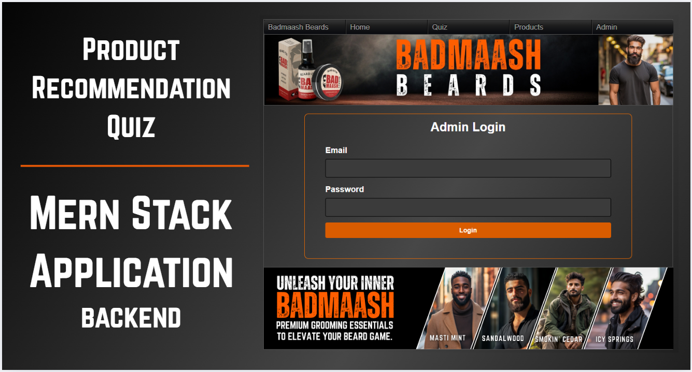
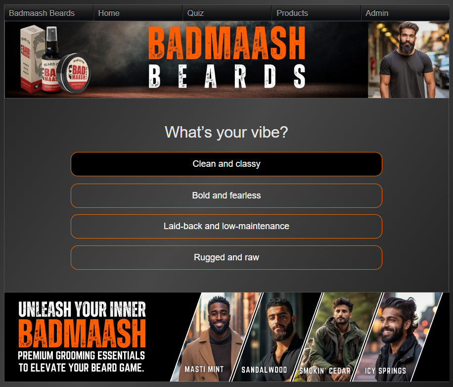
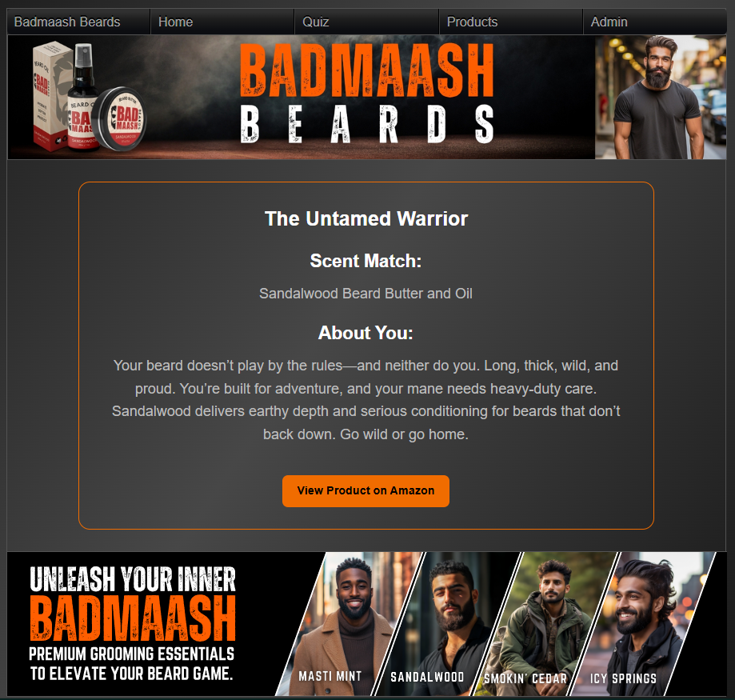

# Product Recommendation Quiz Application for Badmaash Beards
## Capstone Project | Backend (MERN Stack)
### This is the Backend API for the Badmaash Beards Product Recommendation Quiz.
### It powers the quiz, user management, and result recommendations using a MongoDB database.

Welcome to the Badmaash Beards Product Recommendation Quiz App — a simple, interactive quiz that helps users find the perfect Badmaash Beards products tailored to their unique style and grooming needs.

Badmaash Beards is a local small business I've been proud to help build from the ground up. From designing the logo and packaging to managing Amazon listings with SEO optimization, A+ content creation, social media marketing, and website design — I've been involved in every step of the brand's journey.

For my capstone project, I wanted to elevate this experience by developing a quiz app that guides customers to the right products with ease and fun. This project has been an exciting opportunity for me to combine my creative and technical skills, pushing myself further into full stack development.

# API Routes
## User Routes
* Method	        Endpoint	            Purpose
* POST	        /quiz/users	            Create a new user (from UserForm submission)
* GET	        /quiz/users	            Get all users (for Admin Panel)
* PUT	        /quiz/users/:id	        Update a user's username
* DELETE	    /quiz/users/:id	        Delete a user by ID

## Question Routes
* Method	        Endpoint	               Purpose
* GET	        /quiz/questions	        Fetch quiz questions for the quiz flow
* PUT	        /quiz/questions/:id	    Update quiz questions (Admin Panel)

## Results Routes
* Method	        Endpoint	                Purpose
* POST	    /quiz/results	            Calculate product recommendation based on quiz answers
* GET	    /quiz/results/:resultId	    Get result details (title, scent match, description)

# Tech Stack
- **Frontend**: React.js, React Router, Axios, Vite
- **Backend**: Node.js, Express.js, Mongoose, MongoDB 
- **Styling**: Custom CSS, Flexbox, Responsive Design
- **Version Control**: Git & GitHub

---
## Environment Variables (.env)
MONGO_URI=mongodb+srv://<your-mongo-cluster-url>
PORT=5055
VITE_ADMIN_EMAIL=admin@gmail.com
VITE_ADMIN_PASSWORD=password

## Screenshots

## Deployed Site:
https://syed-ferheen-frontendproductquizapp.onrender.com/

## Setup Instructions

### Running the Backend Server
Install dependencies
npm install

### Start server (dev mode)
npm run dev

### Start server (production mode)
npm start

### Backend will be available at: http://localhost:5055

### Frontend
git clone https://github.com/ferheen4535/Syed_Ferheen_FrontendProductQuizApp_Capstone

